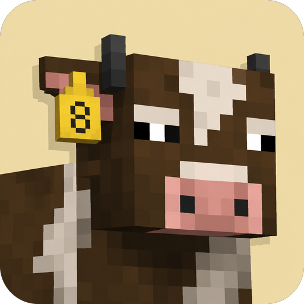

# Animal Weights

<p align="center">
  
</p>

<p align="center">
  <a href="https://modrinth.com/mod/animal-weights"></a>
  <a href="https://www.curseforge.com/minecraft/mc-mods/animal-weights"></a>
</p>

A Minecraft NeoForge mod that gives farm animals a **weight** value that responds to how well they're kept — affecting how much meat, leather, and XP they drop when killed.

Download: [Modrinth](https://modrinth.com/mod/animal-weights) · [CurseForge](https://www.curseforge.com/minecraft/mc-mods/animal-weights) · [GitHub Releases](https://github.com/joseph-osullivan/animal-weights/releases)

Original concept: [u/Axoladdy on Reddit](https://www.reddit.com/r/Minecraft/comments/1te0m69/animal_weights_a_simple_mechanic_to_encourage/).

See the [screenshot walkthrough](screenshots/README.md) for a visual tour of the mechanic.

## What it does

Every cow, pig, sheep, chicken, rabbit, and mooshroom carries an integer **weight** between 0 and 8 (default 1). Each in-game day at dawn, the mob is evaluated against four living conditions in its surroundings:

| Condition | What satisfies it |
|---|---|
| **Light** | A block within 8 blocks of the mob has brightness ≥ 14 (torch, lantern, full daylight). |
| **Water** | A water source block or filled water cauldron (bucket-filled or rain-filled) is reachable from the mob — i.e. horizontally adjacent (or one block below) a cell the mob can BFS-walk to. Fences and walls block reachability. |
| **Grazing** | A grass or moss block is directly below a cell the mob can walk to. |
| **Stretching** | The mob has at least 6 walkable cells reachable around it (no fences or other farm animals blocking). |

The number of conditions met determines the daily weight change:

| Conditions met | Weight change |
|---|---|
| 4 | **+1** (thriving) |
| 3 | 0 (plateau) |
| 2 | −1 (slipping) |
| 0–1 | −2 (suffering) |

Weight is clamped to the range [0, 8].

### Drop scaling

When a target-species mob is killed, its primary drops and XP are scaled by its weight using an accelerating curve:

| Weight | Drop bonus |
|---|---|
| 1 | +0 (vanilla) |
| 2 | +1 |
| 3 | +2 |
| 4 | +3 |
| 5 | +4 |
| 6 | +6 |
| 7 | +8 |
| 8 | **+11** (peak payoff) |

Primary drops by species:

- **Cow / Mooshroom** — beef (raw or cooked), leather
- **Pig** — porkchop (raw or cooked)
- **Sheep** — mutton (raw or cooked), any-colour wool
- **Chicken** — raw chicken, cooked chicken, feathers
- **Rabbit** — raw rabbit, cooked rabbit, hide (rabbit's foot is *not* scaled — it's a rare drop)

### Sick state (weight 0)

A mob whose weight falls to 0 is considered sick:

- **Slowness I** is continuously applied while server-side ticks it.
- Breeding is blocked — `BabyEntitySpawnEvent` is cancelled and both parents' love state is reset if either parent is sick.
- Drops are penalised: each primary drop has a 50% chance of being removed entirely, and any stack that does drop is capped to a single item.

### Babies

Baby animals are skipped from all of the above — no weight evaluation, no slowness, no drop scaling. Babies are transient (vanilla baby growth = 20 real minutes) and the mechanic is meant for the long-term husbandry signal of an adult animal.

## Installation

This mod requires **NeoForge 26.1.x** (Minecraft 26.1.x). Download the jar from the [latest release](https://github.com/joseph-osullivan/animal-weights/releases) or build from source per the steps below.

To install in a vanilla NeoForge installation:

1. Build the mod jar (see "Building from source").
2. Drop `build/libs/animal-weights-<version>.jar` into your `mods/` folder.
3. Launch Minecraft with the NeoForge profile.

The mod is **server-side** for all gameplay logic — only the host of a multiplayer server or single-player world needs the mod installed. (Connected clients still need it to see effect particles correctly, since vanilla replicates `Slowness` to clients.)

## Building from source

Requirements:

- JDK 25 (Temurin recommended).
- Internet access on first build (Gradle downloads NeoForge + Minecraft artifacts).

```bash
./gradlew build                # compile + package the jar into build/libs/
./gradlew runClient            # launch a dev client with the mod loaded
./gradlew runServer            # launch a dev dedicated server with the mod
./gradlew test                 # run Tier-1 JUnit unit tests
./gradlew runGameTestServer    # run Tier-2 in-world GameTests
./gradlew integrationCheck     # all of the above, used by CI
```

If your shell doesn't have a JDK 25 on `JAVA_HOME`, set it before invoking gradle:

```bash
export JAVA_HOME=/path/to/jdk-25
```

## CI

`.github/workflows/ci.yml` runs `./gradlew integrationCheck` on every pull request and every push to `main`. Both Tier-1 JUnit and Tier-2 GameTests run in CI.

## Project layout

```
src/main/java/.../animalweights/
  AnimalWeights.java               — mod entry class
  AnimalWeightAttachment.java      — per-entity weight (NeoForge AttachmentType<Integer>)
  AnimalWeightsTuning.java         — centralized tuning constants
  event/                           — handlers (daily eval, drop scaling, sick state)
  gametest/                        — Tier-2 GameTest bodies + ModGameTests aggregator

src/main/resources/data/animalweights/test_instance/
  *.json                           — GameTest function registrations (one per test)

src/test/java/.../animalweights/unit/
  *.java                           — Tier-1 JUnit tests for pure-int logic
```

See [`src/main/java/io/github/josephosullivan/animalweights/gametest/README.md`](src/main/java/io/github/josephosullivan/animalweights/gametest/README.md) for a catalog of every GameTest and what it pins.

## Licence

MIT (see `LICENSE`).
