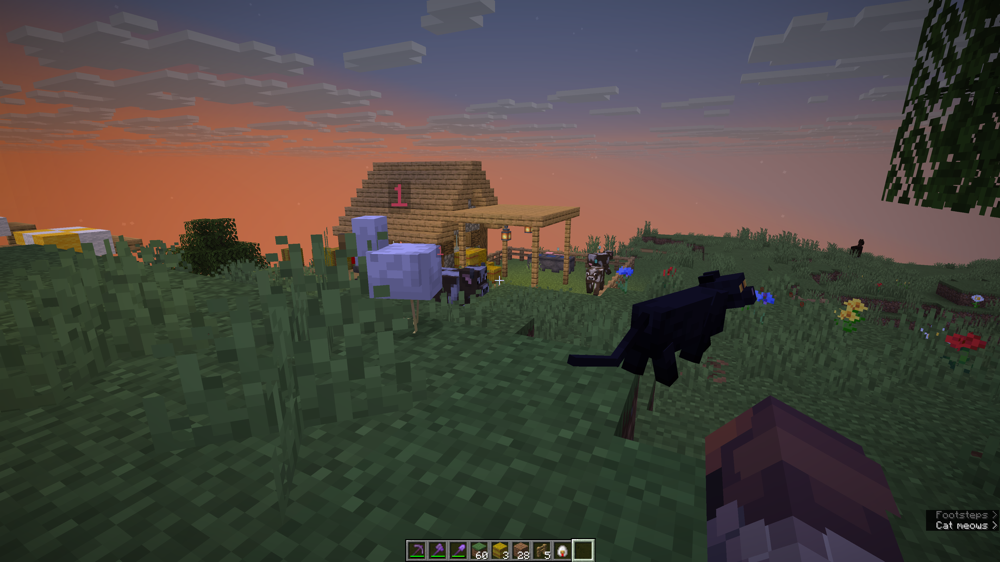
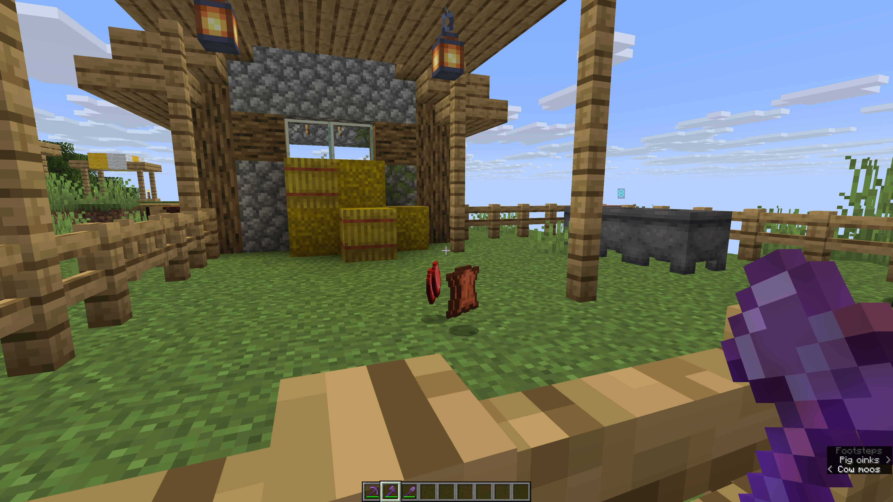
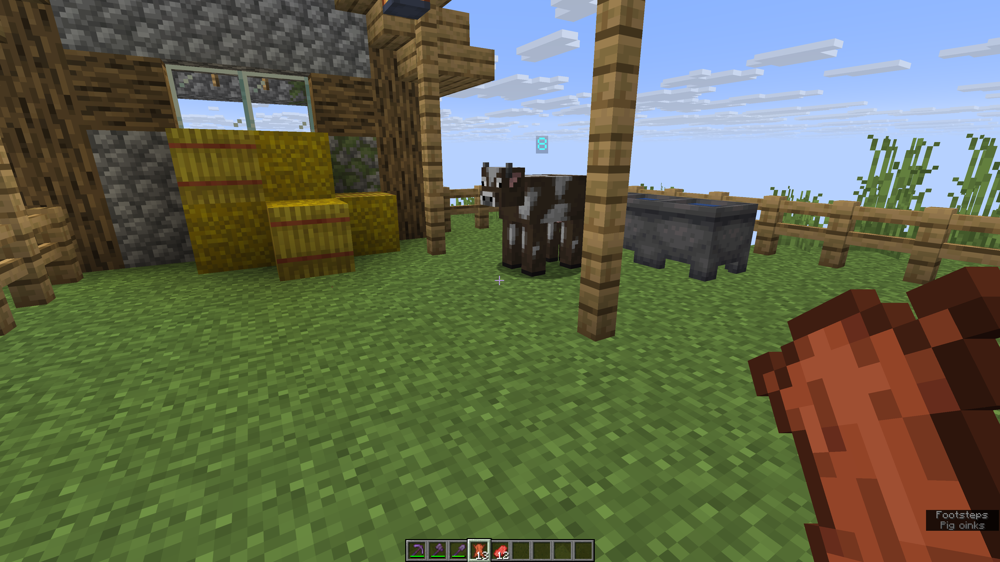

# Animal Weights — Walkthrough

A visual tour of what the mod does in-game. For the full mechanic spec, see the [main README](../README.md).

---

## 1. Every farm animal carries a weight

Cows, pigs, sheep, chickens, rabbits, and mooshrooms all get an integer weight from 0 to 8, shown above their head. New mobs spawn at weight 1.

---

## 2. Default state: weight 1, vanilla drops

A freshly-spawned animal wandering the world starts at weight 1 — vanilla drops, vanilla XP, no sickness. Nothing changes until you put it in (or near) something.

---

## 3. Cramped pens make animals sick

Stuff a herd into a tiny pen with no light, no water, and no grass and their weight ticks down every in-game day. At weight 0 they turn sick — Slowness I, no breeding, and their drops get capped and culled.

---

## 4. Good conditions push weight up

Give an animal light (≥ 14 brightness), water (a source block or filled cauldron it can reach), grass to graze on, and at least 6 walkable cells around it, and it gains weight every day at dawn. Three of four conditions plateaus it; all four pushes it toward 8.

---

## 5. Peak: weight 8

A well-kept pen converges on weight 8 and stays there. This is what "thriving" looks like.

---

## 6. The payoff — drops scale with weight

Kill a weight-8 cow and instead of 1–3 beef you get **+11 extra** primary drops on top of vanilla. The curve is accelerating, so weights 7 and 8 are where the real payoff is.

---

## Drop curve summary

| Weight | Drop bonus |
|---:|:---|
| 1 | +0 (vanilla) |
| 2 | +1 |
| 3 | +2 |
| 4 | +3 |
| 5 | +4 |
| 6 | +6 |
| 7 | +8 |
| 8 | **+11** |

That's the whole loop: keep your animals well, and they're worth several times more than vanilla on slaughter day.
